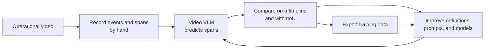

# industrial-vlm-temporal-grounding

[日本語](README.md) | [Documentation](docs/README.md)


**Toward a Connected Worker platform that understands factory procedures in real time and catches critical deviations before they cause harm.**

<p align="center">
  <br>
  <sub>Ten Factory Ego clips playing back to back. Orange shows human spans; blue shows Marlin-2B predictions.</sub>
</p>

## Catch procedural mistakes before they become incidents

In a factory, a skipped step, incorrect order, unsafe tool operation, or missed inspection can lead to life-threatening incidents, equipment damage, quality defects, or production downtime. Reviewing recorded footage after the event cannot support the worker at the moment it matters.

The intended system continuously analyzes first-person video from a wearable camera with a small VLM. It should understand the current operation, completed steps, and steps that have not yet occurred, then notify a worker or supervisor when a critical deviation begins to emerge—before an incident or loss is final.

- **Support work as it happens** — frontline workers should be able to continue hands-free work while receiving an immediate indication of a skipped step or unsafe action
- **Prevent incidents and loss** — supervisors and manufacturing engineers should be able to respond before a deviation becomes an injury, defect, or equipment stop
- **Run locally with low latency** — models with at most 4B parameters are the primary target, allowing a future path to continuous inference on a wearable or nearby edge computer without sending sensitive footage to an external API
- **Accumulate site-specific knowledge** — precise event descriptions and spans can capture tools, parts, grips, and placements, while human corrections flow into fine-tuning and re-evaluation

As a foundation for that system, this repository focuses on **temporal grounding**: locating an event in time.

```text
Input:  video + "The worker turns a bag upside down and drops parts into a bin"
Output: the event's start/end timestamps, or absent
```

Real-time procedure analysis requires more than recognizing an object or action. The system must know when each operation starts and ends, in what order it occurs, and what has not occurred. Accurate timestamps can feed higher-level logic for the current step, omissions, order violations, and abnormal duration.

The current work first establishes this temporal capability on short clips. Temporal IoU (tIoU) measures the difference from human spans and provides one contract for improving event definitions, prompts, models, and training data. The purpose is to support safe and correct work while it is happening.

**The source of advantage is not a larger general-purpose model. It is the ability to encode safety- and quality-critical site procedures as precise event definitions and timestamps, then continuously transfer that knowledge into a small model that can eventually run in real time.**

## Validating temporal understanding with Factory Ego

The primary pilot uses 20 fixed industrial first-person clips from [Egocentric-10K](https://huggingface.co/datasets/builddotai/Egocentric-10K). Each clip is 20 seconds at 2 fps. A human watches the footage, writes Japanese event descriptions, and marks the reference spans. External machine-generated annotations are not used as ground truth.

**All 20 clips are now annotated with 75 events and 88 reference spans**, compared against Marlin-2B temporal-grounding output. The table selects one stored result compatible with the current event definition for every clip and combines all 20 clips into one view. A mean tIoU of `1.0` is a perfect overlap with the human spans; `0.0` means no overlap.

| 20-second clip | What happens in the footage | Marlin-2B<br>mean tIoU |
|---|---|---:|
| [Assembling and replenishing metal parts](datasets/factory_ego/sops/f001_w004_material_replenishment/sop.yaml) | Fasten a part with a power driver, pour parts from an inverted bag, and bundle the empty bag | 0.086 |
| [Metal stamping workflow](datasets/factory_ego/sops/f001_w011_metal_stamping/sop.yaml) | Feed strip material into a press, walk to the next machine, and align a stack of metal sheets | 0.507 |
| [Bagging folded garments](datasets/factory_ego/sops/f002_w002_garment_bagging/sop.yaml) | Insert a folded garment into a clear bag, seal it, and move the finished package | 0.566 |
| [Folding a garment](datasets/factory_ego/sops/f002_w003_fabric_folding/sop.yaml) | Pick up a light-blue garment, fold it, and lift a black hanger | 0.504 |
| [Folding a shirt with a board](datasets/factory_ego/sops/f002_w005_garment_ironing/sop.yaml) | Fold a shirt around a board, turn it over, and stack the finished item | 0.645 |
| [Finishing cast-metal parts](datasets/factory_ego/sops/f003_w005_metal_casting/sop.yaml) | Carry cast parts into a wooden box and strike parts with a wood-handled hammer | 0.350 |
| [Cleaning and marking a yellow part](datasets/factory_ego/sops/f003_w007_wax_pattern/sop.yaml) | Clean a yellow part, mark it with white chalk, and place it in a tray | 0.405 |
| [Removing a molded part](datasets/factory_ego/sops/f003_w009_injection_molding/sop.yaml) | Remove a yellow plastic part from a metal mold and pick up a metal rod | 0.391 |
| [Placing a lid on a mold](datasets/factory_ego/sops/f003_w010_mold_preparation/sop.yaml) | Place a yellow lid over a mold | **0.719** |
| [Trimming garment threads](datasets/factory_ego/sops/f004_w002_thread_trimming/sop.yaml) | Cut garment threads with scissors and spread the garment on a table | **0.695** |
| [Feeding a black garment into a sewing machine](datasets/factory_ego/sops/f004_w004_continuous_fabric/sop.yaml) | Spread a black garment, align its edge, and feed it under the presser foot | 0.498 |
| [Handling fabric after heat pressing](datasets/factory_ego/sops/f004_w005_heat_press/sop.yaml) | Open the press, remove a white fabric item, then spread and fold the next piece | 0.594 |
| [Overlock sewing pink fabric](datasets/factory_ego/sops/f004_w005_overlock_seaming/sop.yaml) | Sew and remove one piece, align the next fabric edge, and move it to the needle | 0.301 |
| [Sewing a curved fabric edge](datasets/factory_ego/sops/f004_w006_curvilinear_seam/sop.yaml) | Align a curved gray edge, position it under the presser foot, and guide it while sewing | 0.633 |
| [Binding a garment edge](datasets/factory_ego/sops/f004_w006_edge_binding/sop.yaml) | Sew the bound edge of a gray garment, cut excess binding, and spread the garment again | 0.228 |
| [Operating a winding machine](datasets/factory_ego/sops/f005_w001_semi_automatic/sop.yaml) | Place a ring-shaped coil on a fixture, arrange cord-like material, and use the control panel | 0.380 |
| [Operating a manual lathe](datasets/factory_ego/sops/f005_w010_manual_lathe/sop.yaml) | Turn a fixture with a box wrench, put the wrench down, then operate the controls and handwheel | 0.605 |
| [Mounting a fixture in a CNC machine](datasets/factory_ego/sops/f005_w011_cnc_machine/sop.yaml) | Carry and mount a square fixture, use the control panel, and close the machine door | 0.423 |
| [Sorting cylindrical metal parts](datasets/factory_ego/sops/f006_w004_bulk_material/sop.yaml) | Repeatedly lift similar parts from a large bin and move them to two destinations | 0.013 |
| [Positioning a compression-molding die](datasets/factory_ego/sops/f006_w005_compression_molding/sop.yaml) | Carry a silver die into the press, align it under the upper tool, and move the control lever | 0.552 |

Across all 20 clips, mean tIoU is `0.389` and tIoU@0.5 F1 is `0.491`. The app lets you inspect the human and model spans on the same video to see which event caused each error.

These are development diagnostics on clips and prompts used during iteration, not held-out benchmark accuracy. The table follows the same rule as the app: select model results whose stored SOP hash matches the current definition. Fixed inputs and raw outputs are in [`runs/`](runs/); frozen per-run evaluations are in [`evaluations/`](evaluations/).

## Improvement loop



One web app unifies annotation and results review:

- **Thumbnail gallery** — browse the 20 clips with per-clip progress and mean tIoU, sorted by lowest tIoU first
- **Video-editor timeline** — create and drag human spans next to model predictions on one screen; tIoU and F1 recompute live as spans move
- **Dataset curation** — clips excluded from training and evaluation are flagged in `datasets/<dataset>/curation.json`

Translation, inference, and training remain reproducible CLI stages outside the app. The original Japanese annotation is human ground truth and is never overwritten by a model prediction.

## Quick start

Python 3.10+ and ffmpeg are required. Factory Ego also requires accepting the access terms for `builddotai/Egocentric-10K` on Hugging Face.

```bash
python3 -m venv .venv
source .venv/bin/activate
python -m pip install -e ".[test,fetch]"
python tools/benchmark/fetch_factory_ego.py --apply
python tools/benchmark/validate.py --require-media
sop-app --dataset factory_ego
```

Annotation follows a video-first workflow:

1. Watch the clip and decide which operational events need distinct labels.
2. Describe the visible actor, object, and action precisely in Japanese.
3. Add each occurrence at frame-level resolution.
4. Use still frames and one-frame movement to refine boundaries.
5. Review the full timeline for missing or overlapping events.

Edits autosave to `datasets/<dataset>/annotations/human/<unit>.json`. See the [annotation guide](docs/reference/annotator.md) for details.

Open the results in read-only mode with:

```bash
sop-view --dataset factory_ego
```

The writable `sop-app` is localhost-only. For network sharing, do not expose its unauthenticated editing API; use `sop-view --host 0.0.0.0`.

## Two inference methods

| Method | VLM input | VLM output | Span construction | Role |
|---|---|---|---|---|
| Temporal Grounding | Video + event description | Start/end timestamps, or absent | Preserve the VLM span output | **Primary** |
| Frame Classification | One image at a time + question | Per-frame yes/no | Convert the answer sequence with rules | Baseline |

The primary method gives a video to a Video VLM and asks the model to produce temporal spans directly. The frame-classification rule engine is a comparison experiment for handling duration, short noise, and repeated occurrences in a yes/no sequence; it does not replace temporal-grounding output.

Both methods normalize to the same prediction format and use the same tIoU evaluation.

```bash
sop-check eval \
  --ground-truth datasets/<dataset>/annotations/human/<unit>.json \
  --prediction runs/<run-id>/predictions/<unit>.json
```

## Bring your own video

```bash
sop-dataset init --dataset my_factory --name "My Factory"
sop-dataset add-video --dataset my_factory --unit clip_001 \
  --video /path/to/private.mp4
sop-app --dataset my_factory
```

Events do not need to be predefined on the command line. Reviewers create them while watching the video. See the [bring-your-own-data guide](docs/guides/bring-your-own-data.md).

## Training and data contract

Completed annotations can be exported with `sop-export-ms-swift` as video-SFT JSONL. LoRA/QLoRA runs use [ms-swift](docs/training/ms-swift.md) as the external backend, and pre/post-tuning models are compared under the same contract and split.

```text
datasets/       versioned metadata, event definitions, human GT, splits, hashes
data/           ignored videos, frames, audio, and preview media
runs/           immutable inference runs, raw output, normalized predictions
evaluations/    metrics locked to annotation and prediction hashes
training_runs/  training configuration and input locks; weights/logs ignored
```

Intervals use video-relative half-open seconds, `[start_s, end_s)`. Human facts, model predictions, and evaluations remain separate. See the [data contract](docs/benchmark/data-contract.md).

## Current scope

The current scope is offline annotation, prediction review, evaluation, and training export for short video clips. This stage builds the temporal model and ground truth required for real-time procedure analysis. Wearable deployment, streaming inference, alert logic, power consumption, and latency have not yet been validated.

The repository output alone is not intended to automate life- or equipment-critical safety decisions. Production deployment requires site-specific risk assessment, fail-safe controls, human oversight, and a clear boundary with existing safety systems.

Full videos, ordinary extracted frames, model weights, and personal data are not committed. The hero GIF is the only downsampled demonstration derivative containing Egocentric-10K imagery; attribution and terms are documented in [`docs/assets/README.md`](docs/assets/README.md).

## Validation

```bash
python -m pytest -q
python tools/benchmark/validate.py
sop-dataset validate --dataset factory_ego
python tools/quality/check_docs.py
python tools/quality/check_public.py
```

Code is released under the [MIT License](LICENSE). External data, models, and checkpoints retain their own licenses and access terms.
