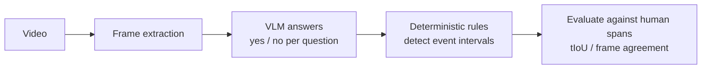

# small-vlm-sop-check

[日本語](README.md) | [Documentation](docs/README.md)


**Small, offline VLMs for industrial egocentric video — detecting SOP step intervals, frame by frame, toward real-time streaming.**

An experimental framework that detects when each step of a standard operating procedure (SOP) happens (event intervals) in a factory worker's first-person (egocentric) video, using only small local VLMs.

<p align="center">
  
</p>

## Why this exists

- 🏭 **Industrial focus** — video analysis specialized for factory and manufacturing work, not general video understanding such as movies, game streams, or kitchen egocentric datasets (e.g. Ego4D)
- ✅ **Procedure first** — instead of captioning or summarizing the video, answer "did the worker perform this SOP step?" at **yes / no granularity** and detect the interval where each step happens. The local VLM only answers per-frame questions; deterministic rules derive the intervals
- 🔒 **Fully offline** — footage never leaves the site; everything runs on a small local VLM on Apple Silicon
- ⏱️ **Streaming-oriented** — frames are processed causally from the front rather than feeding the whole video at once, aiming at real-time streaming
- 🎓 **Toward training** — beyond evaluation: build human ground-truth data and use it to train and improve small industrial VLMs

## What it does

- Detects the interval of each SOP step from a video and an SOP
- Evaluates event intervals and per-frame answers against human ground truth
- Provides CLI tools for annotation, inference, evaluation, and replay
- Includes results from 15 local VLMs tested under the same demo conditions

## Quick start

Python 3.10 or newer is required. The first example runs the deterministic rule engine against the bundled answer log, so no VLM dependency is needed.

```bash
python3 -m pip install -e .

sop-check detect \
  --sop datasets/konro_inspection/sops/konro_inspection/konro_inspection.yaml \
  --answer-log datasets/konro_inspection/fixtures/reference_outputs/answer_log.json
```

Expected result:

```text
event          status          t(s)  span(idx)
ignite         detected         3.0  1-5
flame_seen     detected         3.0  3-3
...
gloves_worn    NOT_DETECTED       -

検出: 6/7 イベント
```

Generate a self-contained replay viewer with:

```bash
sop-replay
```

## Design

The VLM only answers visual questions for each frame. A deterministic rule engine derives event intervals from the answer sequence (minimum duration, bridging short noise, assigning the n-th occurrence).



This separation makes it possible to distinguish visual errors from rule errors, rerun event detection against a saved answer log, and keep human facts separate from model predictions. See [ADR 0001](docs/decisions/0001-separate-facts-predictions-evaluations.md) for the rationale.

## Run with a local VLM

The reference MLX backend requires macOS on Apple Silicon.

```bash
python3 -m pip install -e ".[vlm]"

sop-check run \
  --sop datasets/konro_inspection/sops/konro_inspection/konro_inspection.yaml \
  --video datasets/konro_inspection/units/konro_inspection/media/konro_inspection.mp4 \
  --model qwen3-4b \
  --out-dir out/qwen3-4b
```

The model is downloaded on first use. Run `sop-check models` to list registered model aliases.

## Evaluation

Detected event intervals are compared against human `ground_truth.json` (detected / missed / false detection / correctly absent).

```bash
sop-check eval \
  --sop datasets/konro_inspection/sops/konro_inspection/konro_inspection.yaml \
  --ground-truth datasets/konro_inspection/annotations/human-v001/konro_inspection.json \
  --answer-log datasets/konro_inspection/fixtures/reference_outputs/answer_log.json
```

Metrics include mean temporal IoU and per-question frame agreement.

## Bundled benchmarks

### Konro Inspection

A complete demo with one 16-frame gas-stove inspection video and human ground truth. Among the 15 tested models, Qwen3-VL-4B was the only model that closely reproduced the human spans (mean tIoU 0.80, frame agreement 96%).

This is a result for one short demo video, not an estimate of general factory performance. See the [full benchmark tables and reproduction commands](docs/benchmark/konro-results.md).

### Factory Ego

An in-progress comparison dataset of 20 units (20 seconds, 2 fps, 40 frames each) stratified across six factories and twenty work types in Egocentric-10K, aimed at procedure-compliance judgment. Factory first-person footage is chosen over kitchen or daily-life egocentric datasets (e.g. Ego4D) because this repository deliberately specializes in industrial and manufacturing work. Clip selection uses the LLM-generated transcripts of [annotated-egocentric-10k-dataset](https://github.com/fit-alessandro-berti/annotated-egocentric-10k-dataset), which are never treated as ground truth; event definitions are authored by viewing the extracted frames (see docs/benchmark/events.md). Each SOP defines 3-4 procedure-step events with Japanese single-sentence questions. All current units are `dev_seen`. Human ground truth is not available yet, so formal precision, recall, F1, and tIoU are not reported. Because the upstream dataset is gated, extracted frames are excluded from the public repository and only SHA manifests are tracked. After accepting the upstream gated terms, `tools/benchmark/fetch_factory_ego.py` reconstructs byte-identical local media (see the [operations guide](docs/benchmark/operations.md)).

Prediction runs so far: one Claude Opus 4.8 online-inference run over a causal window of the last five frames (20/20 units), plus pilot6-subset runs of 12 small local VLMs. Formal accuracy stays unreported until human ground truth is available. See the [Factory Ego dataset notes](datasets/factory_ego/README.md) and [current comparison report](reports/model_comparison.md).

## Repository layout

```text
src/            Python package and CLI
datasets/       media units, SOPs, and human annotations
runs/           immutable model predictions
evaluations/    prediction-to-ground-truth evaluations
reports/        cross-run comparisons
schemas/        benchmark JSON Schemas
tools/          migration and quality checks
tests/          unit and integration tests
docs/           design, operations, and decisions
```

Start with the [documentation index](docs/README.md), [SOP format](docs/reference/sop-format.md), and [benchmark overview](docs/benchmark/README.md).

## Development checks

```bash
python3 -m pip install -e ".[test]"
pytest
python3 tools/benchmark/validate.py
python3 tools/quality/check_docs.py
python3 tools/quality/check_public.py
```

## License

The code is released under the MIT License. See [LICENSE](LICENSE). External datasets and models remain subject to their respective licenses and terms.
