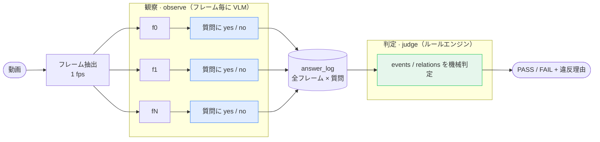

# small-vlm-sop-check

<p align="right"><a href="#english"><b>English</b></a></p>

作業動画が手順書（SOP）どおりかを、ローカルの小型VLMだけで判定する**フレームワーク**。**自分の動画・自分の手順**を持ち込んで、正解データの作成 → 推論 → 評価・可視化までを一式で回せる。

- 動画と手順（YAML）を渡すと **PASS / FAIL と違反の理由**が返る
- ブラウザの注釈ツールで動画に**正解**を付けると、モデルの観察がどれだけ合っていたかまで採点できる
- ローカルVLM 12種で実測済み（[ベンチマーク](#ベンチマーク)）。クラウド・大型モデル不要（Apple Silicon で完結）

<p align="center">
  <br>
  <sub>再生ビューア：各フレームで VLM が何と答え、どのイベントが検出され（右のタイムライン）、総合判定が PASS / FAIL かを再生できる。</sub>
</p>

## 設計の核：観察と判定を分ける

VLMがやるのは**観察**だけ——フレームごとに「つまみを触っている？」に yes / no で答える。順序や遵守の**判定**は決定論的なルールエンジンがやる。小型VLMに時間の前後関係まで推論させると、単純な時刻比較すら間違えるため（実験で確認済み）。



## 使い方 — 自分の動画でSOPチェックを作る

やることは3フェーズ。**人間の仕事はフェーズ1だけ**で、あとはコマンドを叩くだけ。

| フェーズ | ステップ | 作るもの |
|---|---|---|
| **1. データを作る** | ① 動画に正解を注釈する | `ground_truth.json` — **事実**（いつ何が起きたか） |
| | ② 手順を定義する | `sop.yaml` — **規範**（何が正しいか） |
| **2. 推論する** | ③ VLMで観察 → ルールで判定 | `answer_log.json` と PASS / FAIL |
| **3. 評価・可視化** | ④ 二軸で評価する | 判定の成績・観察の成績 |
| | ⑤ 再生して確かめる | `replay.html` |

以下は同梱サンプル（ガスコンロの始業前点検・16フレーム）で説明するが、**動画とYAMLを差し替えればそのまま自分の作業に使える**。

インストール（macOS / Apple Silicon / Python ≥ 3.10。VLM推論を使うステップ③だけ [mlx-vlm](https://github.com/Blaizzy/mlx-vlm) が要る）：

```bash
pip install -r requirements.txt   # 判定・評価だけ試すなら: pip install pyyaml
```

### フェーズ1 — データを作る

#### ① 動画に正解を注釈する

作業を撮った動画を用意したら、まず「この動画で実際に**いつ何が起きたか**」を人間が記録する。最初に、見るべきイベントの語彙をYAMLに書く——VLMに聞く質問（questions）と、回答から「起きた」とみなす条件（events）：

```yaml
sop:
  id: konro_inspection
  name: コンロ始業前点検
  domain_hint: "ガスコンロの点検作業を上から撮った動画"   # VLMに渡す状況説明

questions:
  - id: knob
    ask: "手がコンロ手前のつまみを操作しているか"
    values: ["yes", "no"]      # クォート必須（裸の yes/no はYAMLの真偽値になる）

events:
  ignite:
    evidence: "knob==yes"
    min_frames: 2              # 2フレーム以上続いたら「起きた」（ノイズ耐性）
  point1:
    evidence: "pointing==yes"
    occurrence: 1              # 同じ動作の「1回目」（2回目は別イベントに）

relations: []                  # ルールは次のステップで書く
```

注釈ツールを立ち上げると、動画のフレームとイベント一覧がブラウザに並ぶ：

```bash
python tools/annotator/serve.py \
  --sop your_task/sop.yaml --frames-dir your_task/frames   # 同梱サンプルなら引数なしでOK
```

イベントを選んで**開始フレームと終了フレームをクリックするだけ**（起きないイベントは「起きていない」ボタン）。操作のたびに `ground_truth.json` へ自動保存され、途中で閉じても再開できる。1本あたり1〜2分：

```json
{ "events": { "ignite": {"start_idx": 1, "end_idx": 4},   // frame 1〜4 で起きた
              "gloves_worn": null } }                      // 一度も起きていない
```

ここで記録するのは**事実だけ**。「どの順番が正しいか」はまだ一切出てこない——それは次のステップの仕事。

#### ② 手順を定義する

次に「何が**正しい**作業か」を書く。①で決めたイベントの間に、守らせるルール（relations）を宣言し、この動画の正解判定（expect）を添えて `sop.yaml` を完成させる：

```yaml
relations:
  - ignite before point1       # 点火は指差し確認より前
  - point2 overlaps battery    # 電池の指差し確認は同時に起きてよい
  - not gloves_worn            # 手袋は一度も着けてはいけない

expect:                        # この動画の正解判定（④の採点に使う）
  verdict: PASS
```

手順書の文は、次の3語彙のどれかに必ず翻訳できる：

| 手順書の文 | relation |
|---|---|
| 「AしてからBする」 | `A before B` |
| 「AしながらBする（同時でもよい）」 | `A overlaps B` |
| 「Aしてはいけない」 | `not A` |

書いたルールは**その場で検証できる**：①の正解区間をルールで評価した結果が `expect` と食い違えば、ルールか注釈のどちらかが間違っている（後述の `eval` が ⚠ で知らせる）。「書く → 正解データで検証 → 直す」のループでSOPを作る。細かい文法は [SOPリファレンス](#sopリファレンス)、実例は `examples/konro_inspection/` の3種（正解手順 / 順序違反 / ステップ欠落）。

### フェーズ2 — 推論する

#### ③ VLMで観察し、ルールで判定する

データができたら、あとは機械の仕事。動画 → フレーム抽出 → VLM観察 → 判定まで1コマンド（初回はモデルのダウンロードが走る）：

```bash
python src/cli.py run \
  --sop examples/konro_inspection/sop.yaml \
  --video examples/konro_inspection/data/konro_inspection.mp4 \
  --model qwen3-4b --out-dir out/
```

`--model` を差し替えれば別のVLMで同じパイプラインが走る（[使えるモデル](#使えるモデル)、一覧は `python src/cli.py models`）。観察（`observe`）と判定（`judge`）は分割実行もできる——観察ログさえ残っていれば、判定はGPU不要で数秒：

```bash
# 同梱の観察ログで判定だけ試す（mlx-vlm不要・すぐ動く）
python src/cli.py judge \
  --sop examples/konro_inspection/sop.yaml \
  --answer-log examples/konro_inspection/sample_output/answer_log.json
```

### フェーズ3 — 評価・可視化する

#### ④ 二軸で評価する

フェーズ1で作った2つのデータが、それぞれ別の軸の正解になる：

| 何を評価する | 問い | 正解データ | コマンド |
|---|---|---|---|
| **判定** | PASS / FAIL と**違反の理由**まで当てたか | `sop.yaml` の `expect`（②） | `judge`（`[正解照合]` 行） |
| **観察** | VLMには**事実どおりに見えていた**か | `ground_truth.json`（①） | `eval` |

判定が当たっていても観察がボロボロなら偶然だし、観察が9割合っていても判定を外すことがある——だから2軸で見る。観察の評価（`eval`）は3つの数字を出す：

```bash
python src/cli.py eval --sop examples/konro_inspection/sop.yaml \
  --answer-log examples/konro_inspection/sample_output/answer_log.json
```

- **relations 正答** — SOPの各ルールについて、正解区間と同じ結論（成立／違反）を出せた数。**判定の合否を直接決めるのはこれ**
- **区間の重なり（tIoU）** — 検出した区間が正解区間とどれだけ重なったか（0〜1）。境界が数フレームずれても、ルールの結論が変わらなければ判定には響かない
- **フレーム回答** — フレームごとの yes / no が正解と合っていた割合（どの質問が弱いかの診断用）

#### ⑤ 再生して確かめる

数字だけでは「なぜ外したか」が分からないので、最後はフレーム画像と一緒にブラウザで再生する：

```bash
python tools/replay_viewer/build.py   # tools/replay_viewer/replay.html を生成
```

依存ゼロの1枚HTML（画像埋め込み済み）で、ダブルクリックで開く。フレームを再生しながら「VLMが各質問に何と答え」「どのイベントが検出され」「判定がどうなったか」を1画面で見られる。ヘッダのプルダウンで**モデルを切り替えて見比べられ**、`ground_truth.json` があれば**正解区間の帯（□）と tIoU も自動で重なる**。`--sop` に違反版SOPを渡せばFAILの様子も見られる。

### コマンドまとめ

| コマンド | ステップ | 内容 |
|---|---|---|
| `tools/annotator/serve.py` | ① | 正解アノテーション（ブラウザ・自動保存） |
| `run --sop --video --model --out-dir` | ③ | 抽出 → 観察 → 判定を一気通貫 |
| `observe --sop --frames-dir --out` | ③ | 観察のみ（VLM） |
| `judge --sop --answer-log` | ③④ | 判定 ＋ `expect` との照合 |
| `eval --sop --answer-log` | ④ | 観察の評価（正解アノテーションと突き合わせ） |
| `tools/replay_viewer/build.py` | ⑤ | 結果の再生HTML生成 |
| `models` | — | 動作確認済みモデル一覧 |

## ベンチマーク

このフレームワークを同梱サンプル（同一の16フレーム動画）に適用し、3つのSOP条件——正解手順 / 順序違反 / ステップ欠落——でローカルVLM 12種を評価した。動画は正しい手順どおりなので、正解は「正解手順 = PASS」「違反2条件 = FAIL、かつ**なぜ違反かを正しく指せること**」。

### 判定の評価（PASS / FAIL と"理由"を当てたか）

違反2条件の ✅ は「FAILを出したか」ではなく「**なぜ違反かを正しく指したか**」。単にFAILを出すだけなら "常にFAIL" でも 2/3 当たるので、理由まで要求する。

| モデル | サイズ | 正解手順<br>→ PASS | 順序違反<br>→ 順序逆転を指摘 | ステップ欠落<br>→ 欠落を指摘 | 正答 |
|---|---:|:---:|:---:|:---:|:---:|
| Qwen3-VL-4B | 4B | ✅ | ✅ | ✅ | 3/3 |
| Qwen3.5-4B | 4B | ❌ | ✅ | ✅ | 2/3 |
| Qwen2.5-VL-3B | 3B | ❌ | ✅ | ✅ | 2/3 |
| MiniCPM-V 4.6 | 1.3B | ❌ | ✅ | ✅ | 2/3 |
| InternVL3-2B | 2B | ❌ | ✅ | ✅ | 2/3 |
| Molmo-7B | 7B | ❌ | ✅ | ✅ | 2/3 |
| Gemma4-E2B | 2B | ❌ | ❌ | ✅ | 1/3 |
| Cosmos-Reason1-7B | 7B | ❌ | ❌ | ✅ | 1/3 |
| Qwen3.5-2B | 2B | ❌ | ❌ | ✅ | 1/3 |
| Qwen3.5-0.8B | 0.8B | ❌ | ❌ | ✅ | 1/3 |
| LFM2.5-VL-1.6B | 1.6B | ❌ | ❌ | ✅ | 1/3 |
| Qwen3-VL-2B | 2B | ❌ | ❌ | ✅ | 1/3 |

**正しい手順を PASS と見抜けたのは Qwen3-VL-4B だけ**（過検出による偽陽性FAILを出さないのが難所）。順序違反の ✅ にも中身の差があり、Gemma4-E2B と Cosmos-Reason1-7B は順序逆転を捕まえたのではなく「電池が一度も見えない」だけでFAILしている——verdict の一致だけでは見えない差が、理由の照合で表に出る。

### 観察の評価（人手の正解アノテーションと合っていたか）

同じ観察ログを、人間が動画に付けた正解（`examples/konro_inspection/ground_truth.json`）と突き合わせたもの。`python src/cli.py eval` で再現できる。列は④の3指標（質問別はフレーム一致率）。

| モデル | relations<br>正答 | 区間の重なり<br>mean tIoU | 総合 | 点火<br>`knob` | 炎<br>`flame` | 指差し<br>`pointing` | グリル<br>`grill` | 電池<br>`battery` | 手袋<br>`gloves` |
|---|:---:|---:|---:|---:|---:|---:|---:|---:|---:|
| Qwen3-VL-4B | 6/6 | 0.78 | 96% | 94% | 100% | 81% | 100% | 100% | 100% |
| Qwen2.5-VL-3B | 5/6 | 0.56 | 83% | 50% | 100% | 75% | 94% | 81% | 100% |
| Cosmos-Reason1-7B | 4/6 | 0.58 | 81% | 44% | 100% | 100% | 62% | 81% | 100% |
| Qwen3.5-4B | 4/6 | 0.51 | 77% | 38% | 100% | 75% | 50% | 100% | 100% |
| LFM2.5-VL-1.6B | 4/6 | 0.32 | 50% | 31% | 100% | 44% | 12% | 12% | 100% |
| Qwen3.5-2B | 4/6 | 0.31 | 47% | 25% | 100% | 31% | 12% | 12% | 100% |
| InternVL3-2B | 4/6 | 0.31 | 50% | 31% | 100% | 25% | 12% | 31% | 100% |
| Gemma4-E2B | 3/6 | 0.62 | 82% | 88% | 100% | 31% | 88% | 88% | 100% |
| Molmo-7B | 3/6 | 0.38 | 68% | 50% | 100% | 31% | 31% | 94% | 100% |
| Qwen3.5-0.8B | 3/6 | 0.14 | 67% | 62% | 94% | 31% | 38% | 75% | 100% |
| Qwen3-VL-2B | 3/6 | 0.10 | 77% | 75% | 94% | 88% | 44% | 62% | 100% |
| MiniCPM-V 4.6 | 2/6 | 0.51 | 83% | 44% | 100% | 69% | 88% | 100% | 100% |

**relations を 6/6 正答できたのは Qwen3-VL-4B だけで、これがそのまま唯一の PASS に対応する。** そのQwen3-VL-4Bも観察は満点ではない（指差しを3フレーム過検出、`pointing` 81%）が、ルールの結論が変わらないので判定には響かない——境界のズレは指標側で吸収するという設計どおりの結果。逆にMiniCPM-V 4.6のように総合83%でも relations 2/6 のモデルもあり、**フレーム一致率だけでモデルを選ぶのは危険**。

<details><summary>再現方法</summary>

```bash
# 観察(モデルごとに1回)→ 3条件で判定 + 観察の評価
# lfm2.5-1.6b は mlx-vlm>=0.6.4 が必要（0.6.3はロード不可）
for m in qwen3-4b qwen3-2b qwen3.5-4b qwen3.5-2b qwen3.5-0.8b lfm2.5-1.6b \
         gemma4-e2b cosmos-7b qwen2.5-3b minicpm-4.6 internvl3-2b molmo-7b; do
  python src/cli.py observe \
    --sop examples/konro_inspection/sop.yaml \
    --frames-dir examples/konro_inspection/sample_output/frames \
    --model "$m" --out "out/al_$m.json"
  for cond in sop sop_wrong_order sop_missing_step; do
    python src/cli.py judge \
      --sop "examples/konro_inspection/$cond.yaml" --answer-log "out/al_$m.json"
  done
  python src/cli.py eval \
    --sop examples/konro_inspection/sop.yaml --answer-log "out/al_$m.json"
done
```

questions は3条件で共通なので観察は1回でよい。観察の正解は `examples/konro_inspection/ground_truth.json`（tools/annotator で作成。16フレーム全部を目視して付けた区間）。
</details>

## SOPリファレンス

**relations の意味論** — 3語彙しかないのは意図的。区間同士の時間関係は [Allen の区間代数](https://en.wikipedia.org/wiki/Allen%27s_interval_algebra)で13種類に尽きるが、1fps＋VLMの境界ノイズの下では meets と overlaps のような細かい区別は観測不能なので、ノイズで壊れない粒度まで潰してある。

| relation | 実装 |
|---|---|
| `A before B` | 代表時刻（区間の平均時刻）の比較（± `order_tolerance_s`）。点ベースなのは順序判定を境界のブレから守るため |
| `A overlaps B` | 検出区間が交わっているか。「同時でよい」「この間のどこかで一度起きればよい」の両方を表せる |
| `not A` | A が一度も検出されないこと（安全条件・禁止工程） |

**occurrence（何回目か）** — 同じ質問（例:「指差ししてる？」）が動画中で何度も yes になるとき、「1回目」「2回目」を区別する番号。指定しないとYAMLの宣言順に早い者勝ちで割り当てられ、書く順番で結果が変わってしまうので、複数回の動作には必ず付ける。

**expect（正解判定）** — その動画に対する期待判定。FAILの場合は「なぜ違反か」まで書ける：

```yaml
expect:
  verdict: FAIL
  because:
    - relation: "battery_check before ignite"   # このルールが…
      kind: order_reversed                      # …順序逆転で破られるはず
    # 工程の欠落を当てさせる場合: - event: gloves_check
    #                             kind: missing
```

`kind` は5種類：`order_reversed`（before の逆転）/ `missing`（イベント未検出）/ `overlap_missing`（重なるはずが離れている）/ `overlap_forbidden`（重なってはいけないのに重なる）/ `forbidden`（`not A` なのに検出）。

**events の調整ノブ** — `min_frames`（Nフレーム以上続いたら検出。持続する動作に）/ `max_gap_frames`（VLMの回答が一瞬ブレても区間をつなぐ）/ `defaults:` セクションで一括指定。

## 使えるモデル

`--model` にはエイリアスか HF / mlx-community のフルIDを渡せる。既定は `qwen3-4b`。

| エイリアス | モデル |
|---|---|
| `qwen3-2b` / `qwen3-4b` | Qwen3-VL 2B / 4B（`qwen3-4b` が既定。2B は JSON が崩れやすい） |
| `qwen3.5-0.8b` / `qwen3.5-2b` / `qwen3.5-4b` | Qwen3.5 0.8B / 2B / 4B（早期fusionのネイティブVLM） |
| `lfm2.5-1.6b` | LFM2.5-VL 1.6B（**要 mlx-vlm ≥ 0.6.4**） |
| `qwen2.5-3b` | Qwen2.5-VL-3B |
| `internvl3-2b` | InternVL3-2B |
| `gemma4-e2b` | Gemma4-E2B |
| `minicpm-4.6` | MiniCPM-V 4.6（思考モデル・1.3B） |
| `molmo-7b` | Molmo-7B |
| `cosmos-7b` | Cosmos-Reason1-7B（NVIDIA物理推論・思考モデル） |

観察の生成は3オプションで調整：

- `--prefill STR`（既定 `{"`）— 応答の先頭をJSONの途中まで固定する。空応答を出すモデル（Molmo）や思考でトークンを使い切るモデル（MiniCPM-V）でも、既定のままクリーンな yes/no JSON が返る。思考の連鎖を使いたいときだけ `--prefill ''`
- `--max-tokens N`（既定200）— `--prefill ''` で思考モデルを回すなら1024程度に
- `--thinking {auto,on,off}` — 思考モードの明示指定（対応モデルのみ）

## リポジトリ構成

```
small-vlm-sop-check/
├── src/
│   ├── observe.py   # 観察: questionsからプロンプト生成 + VLM呼び出し + 信頼度抽出
│   ├── judge.py     # 判定: events/relations ルールエンジン
│   ├── evaluate.py  # 観察の評価: 正解アノテーションとの突き合わせ
│   ├── extract.py   # 動画 -> フレーム(cv2)
│   ├── sop.py       # SOP YAMLの読み込み・検証
│   └── cli.py       # `run`/`observe`/`judge`/`eval` サブコマンド
├── examples/konro_inspection/   # 実動画・フレーム・観察ログ12モデル分・SOP3種・正解アノテーション
├── tools/annotator/             # 正解区間をブラウザで注釈（標準ライブラリのみ・自動保存）
├── tools/replay_viewer/         # 結果をブラウザで再生する1枚HTML生成（replay.htmlはgit管理外）
└── tests/                       # 実データに対する回帰テスト(VLM不要)
```

## English

**small-vlm-sop-check** is a framework for checking whether a work video follows a written procedure (SOP), using only a small local VLM on Apple Silicon. Bring your own video and your own procedure — it covers the whole loop in three phases:

**Phase 1 — Create the data (the only human work).**
① *Annotate ground truth*: a browser tool (`tools/annotator/serve.py`) where you mark when each event actually happened in the video — the *facts*. Auto-saves to `ground_truth.json`.
② *Define the procedure*: write the rules between events in `sop.yaml` (`before` / `overlaps` / `not`) plus the expected verdict — the *norm*, kept strictly separate from the facts.

**Phase 2 — Run inference.**
③ `python src/cli.py run --sop ... --video ... --model qwen3-4b` — extract frames, have the VLM answer per-frame yes/no questions (observation), then judge with a deterministic rule engine. Small VLMs fail even trivial temporal comparisons, so ordering logic is code, not the model. 12 local VLMs tested.

**Phase 3 — Evaluate and visualize.**
④ Two axes: *judgement* — did it get PASS/FAIL and the violation reason right (vs `expect`)? *observation* — did the VLM see what actually happened (vs your annotation: rule agreement, temporal IoU, per-question accuracy) via `python src/cli.py eval`.
⑤ Replay: `tools/replay_viewer/build.py` builds a single self-contained HTML that plays the frames with every model's answers, detected events, and ground-truth spans overlaid.

Key finding from the bundled benchmark (a gas-stove inspection video × 3 SOP conditions × 12 local VLMs): every model can emit FAIL, but only **Qwen3-VL-4B** also recognises the correct run as PASS and pinpoints violation reasons (3/3) — and it is the only model that agrees with human ground truth on all 6 SOP rules. Avoiding false-positive FAILs is the real difficulty, and it hinges on observation quality, not parameter count.

> Full tables and the SOP reference are in the Japanese sections above.

## ライセンス

MIT — [LICENSE](LICENSE) を参照。
