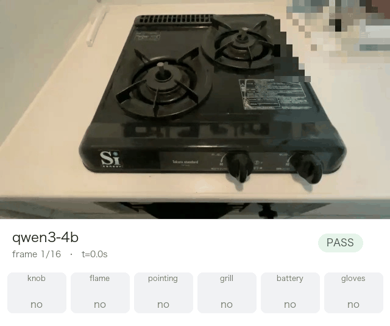
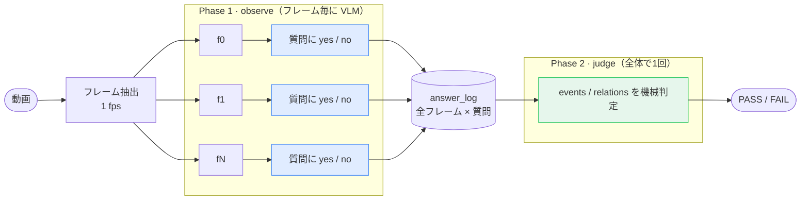

# small_vlm_video_analysis

<p align="right"><a href="#english"><b>English</b></a></p>

作業動画が手順書どおりに行われたかを、ローカルの小型VLM（Qwen3-VL / Apple Silicon）だけで判定するデモ。

作業を撮った動画を渡すと、決められた手順（例：「点火は指差し確認より前」「手袋は着けない」）が守られているかを **PASS / FAIL** で返す。クラウドにも大型モデルにも投げない。

肝は **「観察」と「判定」を分けている** こと。VLMはフレームごとの見た目を yes / no で答えるだけで、順序や遵守のロジックは決定論的なルールエンジンが受け持つ。VLMに時刻の前後関係まで推論させると単純な比較すら間違えるため、そこは機械に任せる。

<p align="center">
  <br>
  <sub><a href="#結果を再生する">再生ビューア</a>：各フレームで VLM が何と答え、どのイベントが検出され（右のタイムライン）、総合判定が PASS / FAIL かを再生できる（同梱の qwen3-4b は PASS）。</sub>
</p>



## しくみ

パイプラインは observe（Phase 1）と judge（Phase 2）の2段。その手前に、人間が手順書を用意する準備が要る。VLMを使うのは Phase 1 だけ。

- **準備（人間）** 動画を見て、守るべき手順を SOP（YAML）に書き下す。何を質問し、何をイベントとみなし、イベント間にどんな前後関係が要るか。
- **Phase 1 — observe（VLM）** 各フレームを VLM に見せ、SOPで決めた質問（例：「手がつまみを触っているか」）に `yes` / `no` / `unclear` を信頼度つきで答えさせる。
- **Phase 2 — judge（ルールエンジン）** 回答を手順ルール（例：「点火は指差し確認より前」）と機械的に突き合わせ、PASS / FAIL を出す。**ここに VLM は使わない。**

## クイックスタート

前提：macOS（Apple Silicon）/ Python ≥ 3.10。`observe`・`run` には [mlx-vlm](https://github.com/Blaizzy/mlx-vlm) が要る（`judge` だけなら不要）。

```bash
pip install -r requirements.txt   # judge だけ使うなら: pip install pyyaml
```

同梱の実データだけで、抽出 → 観察 → 判定を1コマンドで試せる（初回はモデルDLが走る）：

```bash
python src/cli.py run \
  --sop examples/konro_inspection/sop.yaml \
  --video examples/konro_inspection/data/konro_inspection.mp4 \
  --model 4b \
  --out-dir out/
```

一番手軽なのは、観察済みログだけで判定を回すこと（GPU不要・数秒で終わる）：

```bash
python src/cli.py judge \
  --sop examples/konro_inspection/sop.yaml \
  --answer-log examples/konro_inspection/sample_output/answer_log.json
```

## CLI

| コマンド | 内容 |
|---|---|
| `python src/cli.py run --sop --video --model --out-dir` | 抽出 → 観察 → 判定を一気通貫で実行 |
| `python src/cli.py observe --sop --frames-dir --out` | Phase 1 のみ |
| `python src/cli.py judge --sop --answer-log` | Phase 2 のみ |
| `python src/cli.py models` | `--model` に使える動作確認済みエイリアス一覧 |

## SOPフォーマット

YAML1ファイルに3セクション書く。役割はそれぞれ違う：

1. **questions** — フレームごとに VLM に聞く質問
2. **events** — 質問への回答が N フレーム以上続いたら「起きた」とみなす条件
3. **relations** — event どうしの前後・同時性・禁止を宣言

`questions` → `events` → `relations` の順に、observe が答えたものを judge が検出条件に変換し、その検出結果どうしの関係をチェックする。

```yaml
sop:
  id: konro_inspection
  name: コンロ始業前点検
  domain_hint: "これはガスコンロの点検作業を上から撮った動画の1フレームです"

questions:                           # Phase 1 — VLMへのプロンプトをここから自動生成
  - id: knob
    ask: "手がコンロ手前のつまみを操作しているか"
    values: ["yes", "no"]            # クォート必須。裸の yes/no は YAML の真偽値になる

events:                              # Phase 2 — 何を検出するか
  ignite:
    evidence: "knob==yes"
    min_frames: 2                    # 持続する動作はここを上げてノイズ耐性を持たせる
  point1:
    evidence: "pointing==yes"
    occurrence: 1                    # 時系列N番目を明示（宣言順に依存しない。後述）

relations:                           # Phase 2 — イベント間の時間的関係
  - ignite before point1
  - point2  overlaps battery         # 同時に起きてよい
  - not gloves_worn                  # 一度も検出されてはいけない
```

上の例を読み下すと：`knob`（つまみを触っているか）を毎フレーム VLM に聞く（question）→ `knob==yes` が2フレーム以上続いたら `ignite`（点火）が起きたとみなす（event）→ `ignite` は `point1` より前に起きなければならない（relation）。

**relations は3つだけ**

- `before` — A が先、B が後
- `overlaps` — A と B は同時に起きても OK
- `not` — これは一度も起きてはいけない

**occurrence（何回目か）**

同じ質問（例：「指差ししてる？」）を動画中で何度も聞くので、「1回目」「2回目」を区別する番号。指定しないと「YAMLに書いた順番」でなんとなく割り振られ、書く順番を変えると結果が変わってしまう（`tests/test_judge.py::test_occurrence_is_order_independent` で検証）。

**expect（正解＝Phase 0・任意）**

その動画に対する**期待判定と「なぜ違反か（理由）」**を宣言する。judge の結果と突き合わせ、verdict だけでなく違反の理由まで当てられたかを採点できる（[ベンチマーク](#ベンチマーク)はこれで評価している）。省略可。

```yaml
expect:
  verdict: FAIL            # PASS | FAIL（この動画に対する正しい判定）
  because:                 # FAILの「理由」= 当てるべき違反（PASS時は不要）
    - relation: "battery_check before ignite"   # この関係が…
      kind: order_reversed                       # …順序逆転で破られること
    # 未検出（工程の欠落）を当てさせたい場合は event で指定:
    # - event: gloves_check
    #   kind: missing
```

`kind` は違反の種類：`order_reversed`（before の順序が逆）/ `missing`（関係の一方が未検出）/ `overlap_missing`（overlaps なのに離れている）/ `overlap_forbidden`（not_overlaps なのに重なる）/ `forbidden`（`not X` なのに検出）。同梱3条件の正解は各SOPの `expect` に入っている（`sop.yaml` = PASS / `sop_wrong_order.yaml` = 順序逆転 / `sop_missing_step.yaml` = 欠落）。

## 使えるモデル

`--model` にはエイリアス（`qwen3-4b`・`internvl3-2b`・`minicpm-4.6` など）か HF / mlx-community のフルIDを渡せる。一覧は `python src/cli.py models`。既定は基準の `qwen3-4b`（同梱動画で総合 PASS する）。

実際に動くことを確認済みのモデル：

| エイリアス / ID | モデル |
|---|---|
| `qwen3-2b` / `qwen3-4b` | Qwen3-VL 2B / 4B（`qwen3-4b` が基準） |
| `qwen2.5-3b` | Qwen2.5-VL-3B |
| `internvl3-2b` | InternVL3-2B |
| `gemma4-e2b` | Gemma4-E2B |
| `minicpm-4.6` | MiniCPM-V 4.6（思考モデル・1.3B） |
| `molmo-7b` | Molmo-7B |
| `cosmos-7b` | Cosmos-Reason1-7B（NVIDIA物理推論・思考モデル） |

観察の生成まわりは3つのオプションで調整する：

- `--prefill STR`（既定 `{"`）— アシスタント応答の先頭に差し込む文字列。JSONを最初のキーの途中まで固定することで、**Molmo のように最初のトークンで EOS を出して空応答になるモデルや、MiniCPM-V のように思考（`<think>`）でトークンを使い切るモデルでも、既定のまま全フレームでクリーンな yes/no JSON を返させられる**。思考の連鎖をあえて使いたい場合は `--prefill ''` で無効化する。
- `--max-tokens N`（既定200）— 1フレームあたりの最大生成トークン。`--prefill ''` で思考モデルを回す場合は1024程度に上げる。
- `--thinking {auto,on,off}`（既定auto）— 思考モードの明示指定。チャットテンプレートが対応する場合のみ有効。

## ベンチマーク

同梱の `konro_inspection`（同一の16フレーム / 1fps の作業動画）を **3つのSOP条件** で判定させ、各ローカルVLMを評価した。動画は正しい手順どおりなので、正解は「正解手順 = PASS」「順序違反・ステップ欠落 = FAIL、かつ **なぜ違反かを正しく指せること**」。観察は全モデル既定の `--prefill '{"'` で96セル全てに回答する。

各条件の正解（PASS か／違反の「理由」は何か）は、その条件の SOP YAML の `expect:` に宣言してある（[SOPフォーマット](#sopフォーマット)の `expect` を参照）。judge はこの `expect` と実際の判定を突き合わせ、`python src/cli.py judge` が `[正解照合] … 箇所特定 ✓/✗` を出す。

### 判定精度（正しい手順は PASS、違反は"理由"まで当てられるか）

違反2条件の ✅ は「FAIL を出したか」ではなく **「なぜ違反かを正しく指したか」**（順序違反なら `battery_check before ignite` の順序逆転、欠落なら `gloves_check` の未検出）。単に FAIL を出すだけなら全モデル当たるが、それは "常に FAIL" でも当たる 2/3 のベースラインにすぎない。

| モデル | サイズ | 正解手順<br>→ PASS | 順序違反<br>→ 順序逆転を指摘 | ステップ欠落<br>→ 欠落を指摘 | 正答 |
|---|---:|:---:|:---:|:---:|:---:|
| **Qwen3-VL-4B**（基準） | 4B | ✅ | ✅ | ✅ | **3/3** |
| Qwen2.5-VL-3B | 3B | ❌ | ✅ | ✅ | 2/3 |
| MiniCPM-V 4.6 | 1.3B | ❌ | ✅ | ✅ | 2/3 |
| InternVL3-2B | 2B | ❌ | ✅ | ✅ | 2/3 |
| Molmo-7B | 7B | ❌ | ✅ | ✅ | 2/3 |
| Gemma4-E2B | 2B | ❌ | ❌ | ✅ | 1/3 |
| Cosmos-Reason1-7B | 7B | ❌ | ❌ | ✅ | 1/3 |

*（✅ = その条件の正解を当てた。違反列は理由の一致まで要求する）*

**正しい手順を PASS と見抜けるのは基準の Qwen3-VL-4B だけ**（過検出による偽陽性の FAIL を出さないのが難所）。さらに順序違反では、**Gemma4-E2B と Cosmos-Reason1-7B は順序逆転を捕まえたのではなく、電池を一度も検出できず（`battery_check` 未検出）に FAIL している**——どんな誤順序SOPでも「電池が見えない」だけで FAIL するので理由は当てていない。verdict の一致だけでは横並びに見える差が、理由の照合で表に出る。

### どの観察が弱いか（質問＝イベント別の基準一致率）

各セルは基準モデル Qwen3-VL-4B の観察との一致率（16フレームの argmax 一致率。基準は3条件すべて正答するため事実上の正解として扱う）。

| モデル | 総合 | 点火<br>`knob` | 炎<br>`flame` | 指差し<br>`pointing` | グリル<br>`grill` | 電池<br>`battery` | 手袋<br>`gloves` |
|---|---:|---:|---:|---:|---:|---:|---:|
| Qwen3-VL-4B（基準） | 100% | 100% | 100% | 100% | 100% | 100% | 100% |
| Gemma4-E2B | 86% | 94% | 100% | 50% | 88% | 88% | 100% |
| Qwen2.5-VL-3B | 85% | 56% | 100% | 81% | 94% | 81% | 100% |
| MiniCPM-V 4.6 | 83% | 38% | 100% | 75% | 88% | 100% | 100% |
| Cosmos-Reason1-7B | 79% | 50% | 100% | 81% | 62% | 81% | 100% |
| Molmo-7B | 70% | 44% | 100% | 50% | 31% | 94% | 100% |
| InternVL3-2B | 54% | 38% | 100% | 44% | 12% | 31% | 100% |

`flame`（炎）と `gloves`（手袋）はどのモデルも当てる易しい質問。崩れるのは `knob`（点火）・`pointing`（指差し = point1/point2 の分離）・`grill`（グリル）で、どこで崩れるかはモデルごとに違う。**サイズは効かない**（2BのGemma4が総合86%で7BのMolmo/Cosmosより上）。観察品質（Phase 1）がそのまま判定を決める、という本デモの設計思想を裏づける結果。

<details><summary>再現方法</summary>

```bash
# 観察(1回)→ 3条件で判定
for m in qwen3-4b gemma4-e2b cosmos-7b qwen2.5-3b minicpm-4.6 internvl3-2b molmo-7b; do
  python src/cli.py observe \
    --sop examples/konro_inspection/sop.yaml \
    --frames-dir examples/konro_inspection/sample_output/frames \
    --model "$m" --out "out/al_$m.json"
  for cond in sop sop_wrong_order sop_missing_step; do
    python src/cli.py judge \
      --sop "examples/konro_inspection/$cond.yaml" --answer-log "out/al_$m.json"
  done
done
```

questions は3つのSOPで共通なので観察は1回でよい。一致率は各 `out/al_<model>.json` を基準の `examples/konro_inspection/sample_output/answer_log.json` と突き合わせて算出（argmax の一致セル数 / 96）。
</details>

## 結果を再生する

観察・判定の結果を、フレーム画像と一緒にブラウザで再生できる：

```bash
python tools/replay_viewer/build.py   # tools/replay_viewer/replay.html を生成
```

出力は依存ファイルのない1枚のHTML（フレーム画像も埋め込み済み）で、ダブルクリックで開くだけで動く。「今どのフレームで」「VLMが各質問に何と答え」「どのイベントが検出されて」「最終判定が PASS / FAIL か」を1画面で確認できる。`replay.html` はフレーム画像を base64 で埋め込む生成物のため git には含めない（`frames/` は同梱済みなので上記コマンドですぐ作れる）。

**ヘッダのプルダウンでモデルを切り替えられる**（既定で `examples/konro_inspection/sample_output/models/` の7モデルを束ねる）。同じ動画・同じSOPで、Qwen3-VL-4B が PASS する一方、他モデルがどの質問を過検出して FAIL に至るかを見比べられる——ベンチマークの数字を実際のフレームで確かめられる。

- `--sop examples/konro_inspection/sop_wrong_order.yaml` を渡すと、全モデルを順序違反SOPで判定した様子を見られる
- `--answer-log <path>` を渡すと、単一の観察ログだけを表示する（モデル切替なし）
- `--models-dir <dir>` で別のモデルログ群（`<表示名>.json`）に差し替えられる

## リポジトリ構成

```
small_vlm_video_analysis/
├── src/
│   ├── observe.py   # Phase 1: questionsからプロンプト生成 + VLM呼び出し + 信頼度抽出
│   ├── judge.py     # Phase 2: events/relations ルールエンジン
│   ├── extract.py   # 動画 -> フレーム(cv2)
│   ├── sop.py       # SOP YAMLの読み込み・検証
│   └── cli.py       # `run`/`observe`/`judge` サブコマンド
├── examples/konro_inspection/   # 実動画・フレーム・観察ログ・SOP3種
├── tools/replay_viewer/         # 結果をブラウザで再生する1枚HTMLの生成（replay.htmlはbuild.pyで生成・git管理外）
└── tests/                       # 実データに対する回帰テスト(VLM不要)
```

## English

**small_vlm_video_analysis** checks whether a work video was performed according to a written procedure, using only a small local VLM (Qwen3-VL on Apple Silicon). No cloud, no large models.

Feed it a video of a task and it returns **PASS / FAIL** for whether the defined steps were followed (e.g. "ignition must come before the point-and-call check", "no gloves worn").

The core idea is **separating observation from judgement**. The VLM only answers yes/no about what each frame looks like; a deterministic rule engine handles ordering and compliance. Asking a small VLM to also reason about temporal order makes it fail even trivial comparisons, so that part is left to code.

### How it works

Two automated stages, preceded by human prep. The VLM runs only in Phase 1.

- **Prep (human)** — Watch the video and write the procedure as an SOP (YAML): what to ask per frame, what counts as an event, and which temporal relations must hold.
- **Phase 1 · observe (VLM)** — Show each frame to the VLM and have it answer the SOP questions with `yes` / `no` / `unclear`, with confidence.
- **Phase 2 · judge (rule engine)** — Match the answers against the procedure's rules and emit PASS / FAIL. **No VLM here.**

### Quickstart

macOS (Apple Silicon), Python ≥ 3.10. `observe` / `run` need [mlx-vlm](https://github.com/Blaizzy/mlx-vlm); `judge` alone does not.

```bash
pip install -r requirements.txt          # judge only: pip install pyyaml

# full pipeline on the bundled sample (downloads the model on first run)
python src/cli.py run \
  --sop examples/konro_inspection/sop.yaml \
  --video examples/konro_inspection/data/konro_inspection.mp4 \
  --model 4b --out-dir out/

# fastest check: judge a pre-recorded observation log (no GPU, seconds)
python src/cli.py judge \
  --sop examples/konro_inspection/sop.yaml \
  --answer-log examples/konro_inspection/sample_output/answer_log.json
```

### Key finding

Across three SOP conditions (correct / wrong-order / missing-step) on the bundled `konro_inspection` clip, every model can FAIL the two violation cases — but that is the 2/3 baseline you get from "always say FAIL". Only the reference **Qwen3-VL-4B** also recognises the correct run as PASS (3/3). Not over-detecting — avoiding false-positive FAILs — is the real difficulty, and it hinges on observation quality (Phase 1), not parameter count (the 2B Gemma4 beats the 7B Molmo/Cosmos on observation agreement).

> For the SOP format, full benchmark tables, model list and the replay viewer, see the Japanese sections above.

## ライセンス

MIT — [LICENSE](LICENSE) を参照。
