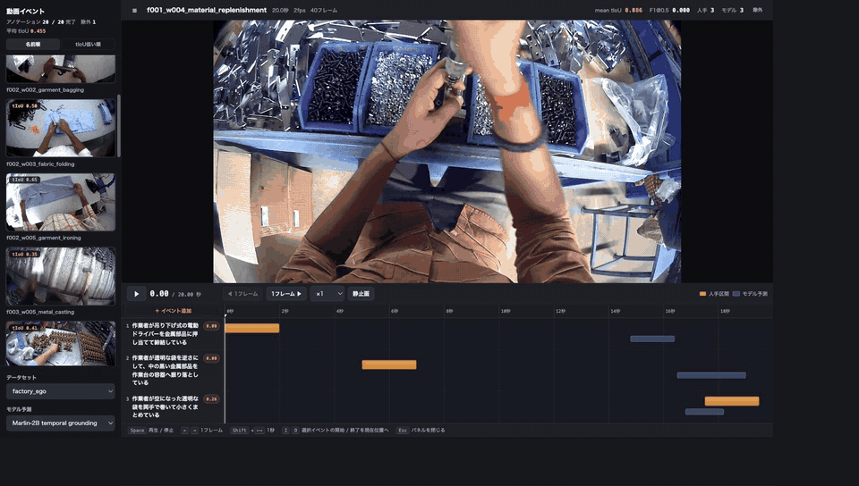
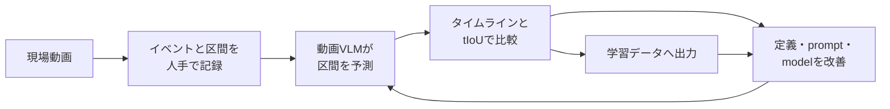

# industrial-vlm-temporal-grounding

[English](README.en.md) | [ドキュメント](docs/README.md)


**工場の作業手順をリアルタイムに理解し、重大な手順逸脱を問題が起きる前に捉えるConnected Worker向け小型VLMの開発基盤を目指します。**

<p align="center">
  <br>
  <sub>Factory Egoの3実験。橙が人手区間、青がMarlin-2Bの予測区間です。</sub>
</p>

## 手順の間違いを、問題が起きる前に捉える

工場では、手順の抜け、順序の間違い、危険な工具操作、確認不足が、人命に関わる事故、設備損傷、品質不良、ライン停止につながることがあります。発生後に録画を見返すだけでは、作業者をその場で支援できません。

目指すのは、ウェアラブルカメラなどの一人称映像を小型VLMで継続的に解析し、現在の作業、完了した手順、まだ行われていない手順を把握することです。重大な逸脱の兆候があれば、事故や損失が確定する前に作業者や監督者へ知らせられるConnected Workerを想定しています。

- **作業中に支援する** — 現場作業員がハンズフリーで作業を続けながら、手順の抜けや危険動作をその場で把握できる状態を目指します
- **事故と損失を未然に防ぐ** — 監督者や生産技術者が、人身事故、不良、設備停止につながる手順逸脱へ早期に対応できるようにします
- **現場内で低遅延に動かす** — 4B以下のモデルを主対象とし、機密映像を外部APIへ送らず、将来はウェアラブル端末や現場側のエッジ端末で継続的に推論できる構成を目指します
- **現場固有の知識を蓄積する** — 工具、部品、持ち方、置き方まで正確なイベント文と時間区間で定義し、人の修正をfine-tuningと再評価へつなげます

そのための基礎能力として、このリポジトリは動画内のイベント区間を特定する**Temporal Grounding**を中心に扱います。

```text
入力: 動画 + 「作業者が袋を逆さにして部品を容器へ落としている」
出力: その動作の開始・終了タイムスタンプ、または「該当なし」
```

リアルタイムで手順を判断するには、物体や動作が見えたかだけでなく、各作業がいつ始まり、いつ終わり、どの順序で起きたかを把握する必要があります。正確なタイムスタンプがあれば、現在の手順、抜け、順序違い、異常な長時間化を判断する上位ロジックへ接続できます。

現在は、まず短い動画を使ってこの時間認識能力を確立しています。人手区間とのずれをTemporal IoU（tIoU）で測り、イベント文、プロンプト、モデル、学習データを改善します。中心目的は、安全で正しい作業を実行中に支援することです。

**競争力の源泉は、より大きな汎用モデルではありません。安全や品質に直結する現場固有の手順を正確なイベント定義とタイムスタンプとして蓄積し、リアルタイムに動かせる小型モデルへ継続的に反映できることです。**

## Factory Egoで時間認識を検証する

主対象は、[Egocentric-10K](https://huggingface.co/datasets/builddotai/Egocentric-10K)から固定した20本の工場一人称動画です。各動画は20秒・2fpsで、人間が映像を見ながら日本語のイベント文と正解区間を作ります。外部の機械生成アノテーションは正解データとして使いません。

現在は6本、25区間の人手アノテーションを作成し、Marlin-2BのTemporal Grounding出力と比較しています。冒頭のGIFには次の3本を掲載しています。

| Factory Ego実験 | イベント数 | mean tIoU |
|---|---:|---:|
| 金属プレス | 4 | 0.816 |
| 衣類の袋詰め | 4 | 0.725 |
| シャツの折り畳み | 4 | 0.645 |

6本・全25正解区間ではmean tIoUが`0.516`、`tIoU@0.5` F1が`0.708`です。同一イベントが複数回起きる動画に対し、現在のMarlin `find()`は1 queryにつき1区間しか返せないため、単一区間の21 event IDに限るとmean tIoUは`0.591`です。

これらはイベント定義とプロンプトの調整にも使ったdevelopmentデータ上の診断値であり、未見動画に対する正式なベンチマーク精度ではありません。固定した入力とraw出力は [`runs/20260714-factory_ego-marlin-2b-reviewed6-tuned/`](runs/20260714-factory_ego-marlin-2b-reviewed6-tuned/)、評価値とhashは [`evaluations/factory_ego_marlin_reviewed6.json`](evaluations/factory_ego_marlin_reviewed6.json) から確認できます。

## 改善ループ



一つのWebアプリで、次の二つを切り替えます。

- **アノテーション** — 動画を見て、日本語のイベント文と複数の発生区間、明示的な非該当を保存
- **結果レビュー** — 人手区間とモデル区間を同じタイムラインに表示し、低tIoUのイベントから確認

推論、翻訳、学習はアプリ内で実行せず、再現可能なCLI工程として分離します。日本語アノテーションは人手の正本として残り、モデル出力が上書きすることはありません。

## Quick start

Python 3.10以上とffmpegを用意します。Factory Egoを使うには、Hugging Faceで `builddotai/Egocentric-10K` の利用条件への同意が必要です。

```bash
python3 -m venv .venv
source .venv/bin/activate
python -m pip install -e ".[test,fetch]"
python tools/benchmark/fetch_factory_ego.py --apply
python tools/benchmark/validate.py --require-media
sop-app --dataset factory_ego
```

アノテーションは次の順で進めます。

1. 動画を通して見て、作業として区別するイベントを決める
2. 映像で確認できる主語、物体、動作を日本語で具体的に書く
3. 発生区間をフレーム単位で追加する
4. 静止画表示と1フレーム移動で開始・終了境界を調整する
5. 動画全体のタイムラインでイベントの抜けや重なりを確認する

変更は `datasets/<dataset>/annotations/human/<unit>.json` へ自動保存されます。詳しい操作は[アノテーションガイド](docs/reference/annotator.md)を参照してください。

結果だけを読み取り専用で開く場合は次を使います。

```bash
sop-view --dataset factory_ego
```

書き込み可能な `sop-app` はlocalhost専用です。ネットワーク越しに共有するときは、認証のない編集APIを公開せず、`sop-view --host 0.0.0.0` を使用してください。

## 二つの推論方法

| 方式 | VLMへの入力 | VLMの出力 | 区間の作り方 | 位置付け |
|---|---|---|---|---|
| Temporal Grounding | 動画＋イベント文 | 開始・終了時刻、または非該当 | VLMの区間出力を保持 | **メイン** |
| Frame Classification | 静止画を1枚ずつ＋質問文 | フレームごとのyes/no | 回答列をルールで秒区間へ変換 | baseline |

メイン方式では動画をVideo VLMへ入力し、モデル自身に時間区間を出力させます。Frame Classificationのルールエンジンは、yes/no列から持続時間、短いノイズ、複数回の出現を処理する比較実験であり、Temporal Groundingの出力を置き換えるものではありません。

どちらも同じprediction形式へ正規化し、人手区間に対して同じtIoUで評価します。

```bash
sop-check eval \
  --ground-truth datasets/<dataset>/annotations/human/<unit>.json \
  --prediction runs/<run-id>/predictions/<unit>.json
```

## 自分の動画を持ち込む

```bash
sop-dataset init --dataset my_factory --name "My Factory"
sop-dataset add-video --dataset my_factory --unit clip_001 \
  --video /path/to/private.mp4
sop-app --dataset my_factory
```

イベントをCLIで事前定義する必要はありません。アプリで動画を見ながら追加できます。詳細は[データ持ち込みガイド](docs/guides/bring-your-own-data.md)を参照してください。

## 学習とデータ契約

完成したデータは `sop-export-ms-swift` で動画SFT JSONLへ出力し、[ms-swift](docs/training/ms-swift.md)をbackendとしてLoRA/QLoRAを準備できます。学習前後は同じ契約とsplitで比較します。

```text
datasets/       Git管理: metadata、イベント定義、人手GT、split、hash
data/           Git管理外: 動画、音声、抽出フレーム、preview
runs/           不変の推論run、raw出力、正規化prediction
evaluations/    annotationとpredictionのhashを固定した評価結果
training_runs/  学習設定と入力lock。checkpointとlogはGit管理外
```

区間は動画先頭を0秒とするhalf-open interval `[start_s, end_s)` です。人手の事実、モデル予測、評価結果を別ファイルに分離します。詳細は[データ契約](docs/benchmark/data-contract.md)にあります。

## 現在の範囲

現在は短い動画クリップに対するオフラインのアノテーション、推論結果レビュー、評価、学習データ出力までを対象とします。これはリアルタイム手順解析に必要な時間認識モデルと正解データを作る段階です。ウェアラブル実機への搭載、ストリーミング推論、警告ロジック、消費電力、遅延はまだ検証していません。

本リポジトリの出力だけで、人命や設備に関わる安全判断を自動化することは想定していません。実運用では、現場ごとのリスクアセスメント、フェイルセーフ、人間による確認、既存の安全装置との役割分担が必要です。

実動画、通常の抽出フレーム、モデル重み、個人データはGitへ含めません。冒頭のGIFだけは、Egocentric-10K由来の画面を縮小したデモ用派生物です。出典と条件は [`docs/assets/README.md`](docs/assets/README.md) に記載しています。

## 検証

```bash
python -m pytest -q
python tools/benchmark/validate.py
sop-dataset validate --dataset factory_ego
python tools/quality/check_docs.py
python tools/quality/check_public.py
```

コードは[MIT License](LICENSE)です。外部データセット、動画、モデル、checkpointには各提供元のライセンスと利用条件が適用されます。
