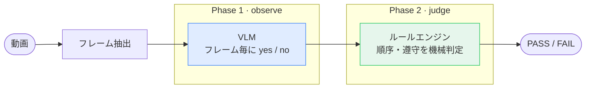

# small_vlm_video_analysis

作業動画が手順書どおりに行われたかを、ローカルの小型VLM（Qwen3-VL / Apple Silicon）だけで判定するデモ。

作業を撮った動画を渡すと、決められた手順（例：「点火は指差し確認より前」「手袋は着けない」）が守られているかを **PASS / FAIL** で返す。クラウドにも大型モデルにも投げない。

肝は **「観察」と「判定」を分けている** こと。VLMはフレームごとの見た目を yes / no で答えるだけで、順序や遵守のロジックは決定論的なルールエンジンが受け持つ。VLMに時刻の前後関係まで推論させると単純な比較すら間違えるため、そこは機械に任せる。

<p align="center">
  <br>
  <sub><a href="#結果の再生ビューア">再生ビューア</a>：フレーム毎のVLMの回答と検出イベント・総合判定を再生できる。同じ動画・同じSOPでも観察VLMを変えると判定は割れる（qwen3-4b=PASS → internvl3-2b=FAIL）。</sub>
</p>



## しくみ

パイプラインは observe（Phase 1）と judge（Phase 2）の2段。その手前に、人間が手順書を用意する準備が要る。VLMを使うのは Phase 1 だけ。

- **準備（人間）** 動画を見て、守るべき手順を SOP（YAML）に書き下す。何を質問し、何をイベントとみなし、イベント間にどんな前後関係が要るか。
- **Phase 1 — observe（VLM）** 各フレームを VLM に見せ、SOPで決めた質問（例：「手がつまみを触っているか」）に `yes` / `no` / `unclear` を信頼度つきで答えさせる。
- **Phase 2 — judge（ルールエンジン）** 回答を手順ルール（例：「点火は指差し確認より前」）と機械的に突き合わせ、PASS / FAIL を出す。**ここに VLM は使わない。**

## クイックスタート

前提：macOS（Apple Silicon）/ Python ≥ 3.10。`observe`・`run` には [mlx-vlm](https://github.com/Blaizzy/mlx-vlm) が要る（`judge` だけなら不要）。

```bash
pip install -r requirements.txt   # judge だけ使うなら: pip install pyyaml
```

同梱の実データだけで、抽出 → 観察 → 判定を1コマンドで試せる（初回はモデルDLが走る）：

```bash
python src/cli.py run \
  --sop examples/konro_inspection/sop.yaml \
  --video examples/konro_inspection/data/konro_inspection.mp4 \
  --model 4b \
  --out-dir out/
```

一番手軽なのは、観察済みログだけで判定を回すこと（GPU不要・数秒で終わる）：

```bash
python src/cli.py judge \
  --sop examples/konro_inspection/sop.yaml \
  --answer-log examples/konro_inspection/sample_output/answer_log.json
```

## CLI

| コマンド | 内容 |
|---|---|
| `python src/cli.py run --sop --video --model --out-dir` | 抽出 → 観察 → 判定を一気通貫で実行 |
| `python src/cli.py observe --sop --frames-dir --out` | Phase 1 のみ |
| `python src/cli.py judge --sop --answer-log` | Phase 2 のみ |
| `python src/cli.py models` | `--model` に使える動作確認済みエイリアス一覧 |

## SOPフォーマット

YAML1ファイルに3セクション書く。役割はそれぞれ違う：

1. **questions** — フレームごとに VLM に聞く質問
2. **events** — 質問への回答が N フレーム以上続いたら「起きた」とみなす条件
3. **relations** — event どうしの前後・同時性・禁止を宣言

`questions` → `events` → `relations` の順に、observe が答えたものを judge が検出条件に変換し、その検出結果どうしの関係をチェックする。

```yaml
sop:
  id: konro_inspection
  name: コンロ始業前点検
  domain_hint: "これはガスコンロの点検作業を上から撮った動画の1フレームです"

questions:                           # Phase 1 — VLMへのプロンプトをここから自動生成
  - id: knob
    ask: "手がコンロ手前のつまみを操作しているか"
    values: ["yes", "no"]            # クォート必須。裸の yes/no は YAML の真偽値になる

events:                              # Phase 2 — 何を検出するか
  ignite:
    evidence: "knob==yes"
    min_frames: 2                    # 持続する動作はここを上げてノイズ耐性を持たせる
  point1:
    evidence: "pointing==yes"
    occurrence: 1                    # 時系列N番目を明示（宣言順に依存しない。後述）

relations:                           # Phase 2 — イベント間の時間的関係
  - ignite before point1
  - point2  overlaps battery         # 同時に起きてよい
  - not gloves_worn                  # 一度も検出されてはいけない
```

上の例を読み下すと：`knob`（つまみを触っているか）を毎フレーム VLM に聞く（question）→ `knob==yes` が2フレーム以上続いたら `ignite`（点火）が起きたとみなす（event）→ `ignite` は `point1` より前に起きなければならない（relation）。

**relations は3つだけ**

- `before` — A が先、B が後
- `overlaps` — A と B は同時に起きても OK
- `not` — これは一度も起きてはいけない

**occurrence（何回目か）**

同じ質問（例：「指差ししてる？」）を動画中で何度も聞くので、「1回目」「2回目」を区別する番号。指定しないと「YAMLに書いた順番」でなんとなく割り振られ、書く順番を変えると結果が変わってしまう（`tests/test_judge.py::test_occurrence_is_order_independent` で検証）。

## 使えるモデル

`--model` にはエイリアス（`qwen3-4b`・`internvl3-2b`・`minicpm-4.6` など）か HF / mlx-community のフルIDを渡せる。一覧は `python src/cli.py models`。既定は基準の `qwen3-4b`（同梱動画で総合 PASS する）。

実際に動くことを確認済みのモデル：

| エイリアス / ID | モデル |
|---|---|
| `qwen3-2b` / `qwen3-4b` | Qwen3-VL 2B / 4B（`qwen3-4b` が基準） |
| `qwen2.5-3b` | Qwen2.5-VL-3B |
| `internvl3-2b` | InternVL3-2B |
| `gemma4-e2b` | Gemma4-E2B |
| `minicpm-4.6` | MiniCPM-V 4.6（思考モデル・1.3B） |
| `molmo-7b` | Molmo-7B |
| `cosmos-7b` | Cosmos-Reason1-7B（NVIDIA物理推論・思考モデル） |

観察の生成まわりは3つのオプションで調整する：

- `--prefill STR`（既定 `{"`）— アシスタント応答の先頭に差し込む文字列。JSONを最初のキーの途中まで固定することで、**Molmo のように最初のトークンで EOS を出して空応答になるモデルや、MiniCPM-V のように思考（`<think>`）でトークンを使い切るモデルでも、既定のまま全フレームでクリーンな yes/no JSON を返させられる**。思考の連鎖をあえて使いたい場合は `--prefill ''` で無効化する。
- `--max-tokens N`（既定200）— 1フレームあたりの最大生成トークン。`--prefill ''` で思考モデルを回す場合は1024程度に上げる。
- `--thinking {auto,on,off}`（既定auto）— 思考モードの明示指定。チャットテンプレートが対応する場合のみ有効。

## ベンチマーク

同梱の `konro_inspection`（同一の16フレーム / 1fps の作業動画）を **3つのSOP条件** で判定させ、各ローカルVLMを評価した。動画は正しい手順どおりなので、正解の判定は「正解手順 = PASS / 順序違反 = FAIL / ステップ欠落 = FAIL」。観察は全モデル既定の `--prefill '{"'` で96セル全てに回答する。

### 判定精度（3条件でいくつ正しく判定できるか）

| モデル | サイズ | 正解手順<br>→ PASS | 順序違反<br>→ FAIL | ステップ欠落<br>→ FAIL | 正答 |
|---|---:|:---:|:---:|:---:|:---:|
| **Qwen3-VL-4B**（基準） | 4B | ✅ | ✅ | ✅ | **3/3** |
| Gemma4-E2B | 2B | ❌ | ✅ | ✅ | 2/3 |
| Cosmos-Reason1-7B | 7B | ❌ | ✅ | ✅ | 2/3 |
| Qwen2.5-VL-3B | 3B | ❌ | ✅ | ✅ | 2/3 |
| MiniCPM-V 4.6 | 1.3B | ❌ | ✅ | ✅ | 2/3 |
| InternVL3-2B | 2B | ❌ | ✅ | ✅ | 2/3 |
| Molmo-7B | 7B | ❌ | ✅ | ✅ | 2/3 |

*（✅ = 期待どおりの判定を出せた）*

違反2条件（順序違反・欠落）は全モデルが FAIL にできるが、これは「常に FAIL と言うだけ」でも当たる **2/3 のベースライン** にすぎない。**正しい手順を PASS と見抜けるのは基準の Qwen3-VL-4B だけ**。過検出による偽陽性の FAIL を出さないことが、このタスクの本当の難所。

### どの観察が弱いか（質問＝イベント別の基準一致率）

各セルは基準モデル Qwen3-VL-4B の観察との一致率（16フレームの argmax 一致率。基準は3条件すべて正答するため事実上の正解として扱う）。

| モデル | 総合 | 点火<br>`knob` | 炎<br>`flame` | 指差し<br>`pointing` | グリル<br>`grill` | 電池<br>`battery` | 手袋<br>`gloves` |
|---|---:|---:|---:|---:|---:|---:|---:|
| Qwen3-VL-4B（基準） | 100% | 100% | 100% | 100% | 100% | 100% | 100% |
| Gemma4-E2B | 86% | 94% | 100% | 50% | 88% | 88% | 100% |
| Qwen2.5-VL-3B | 85% | 56% | 100% | 81% | 94% | 81% | 100% |
| MiniCPM-V 4.6 | 83% | 38% | 100% | 75% | 88% | 100% | 100% |
| Cosmos-Reason1-7B | 79% | 50% | 100% | 81% | 62% | 81% | 100% |
| Molmo-7B | 70% | 44% | 100% | 50% | 31% | 94% | 100% |
| InternVL3-2B | 54% | 38% | 100% | 44% | 12% | 31% | 100% |

`flame`（炎）と `gloves`（手袋）はどのモデルも当てる易しい質問。崩れるのは `knob`（点火）・`pointing`（指差し = point1/point2 の分離）・`grill`（グリル）で、どこで崩れるかはモデルごとに違う。**サイズは効かない**（2BのGemma4が総合86%で7BのMolmo/Cosmosより上）。観察品質（Phase 1）がそのまま判定を決める、という本デモの設計思想を裏づける結果。

<details><summary>再現方法</summary>

```bash
# 観察(1回)→ 3条件で判定
for m in qwen3-4b gemma4-e2b cosmos-7b qwen2.5-3b minicpm-4.6 internvl3-2b molmo-7b; do
  python src/cli.py observe \
    --sop examples/konro_inspection/sop.yaml \
    --frames-dir examples/konro_inspection/sample_output/frames \
    --model "$m" --out "out/al_$m.json"
  for cond in sop sop_wrong_order sop_missing_step; do
    python src/cli.py judge \
      --sop "examples/konro_inspection/$cond.yaml" --answer-log "out/al_$m.json"
  done
done
```

questions は3つのSOPで共通なので観察は1回でよい。一致率は各 `out/al_<model>.json` を基準の `examples/konro_inspection/sample_output/answer_log.json` と突き合わせて算出（argmax の一致セル数 / 96）。
</details>

## 結果を再生する

観察・判定の結果を、フレーム画像と一緒にブラウザで再生できる：

```bash
python tools/replay_viewer/build.py   # tools/replay_viewer/replay.html を生成
```

出力は依存ファイルのない1枚のHTML（フレーム画像も埋め込み済み）で、ダブルクリックで開くだけで動く。「今どのフレームで」「VLMが各質問に何と答え」「どのイベントが検出されて」「最終判定が PASS / FAIL か」を1画面で確認できる。`replay.html` はフレーム画像を base64 で埋め込む生成物のため git には含めない（`frames/` は同梱済みなので上記コマンドですぐ作れる）。

**ヘッダのプルダウンでモデルを切り替えられる**（既定で `examples/konro_inspection/sample_output/models/` の7モデルを束ねる）。同じ動画・同じSOPで、Qwen3-VL-4B が PASS する一方、他モデルがどの質問を過検出して FAIL に至るかを見比べられる——ベンチマークの数字を実際のフレームで確かめられる。

- `--sop examples/konro_inspection/sop_wrong_order.yaml` を渡すと、全モデルを順序違反SOPで判定した様子を見られる
- `--answer-log <path>` を渡すと、単一の観察ログだけを表示する（モデル切替なし）
- `--models-dir <dir>` で別のモデルログ群（`<表示名>.json`）に差し替えられる

## リポジトリ構成

```
small_vlm_video_analysis/
├── src/
│   ├── observe.py   # Phase 1: questionsからプロンプト生成 + VLM呼び出し + 信頼度抽出
│   ├── judge.py     # Phase 2: events/relations ルールエンジン
│   ├── extract.py   # 動画 -> フレーム(cv2)
│   ├── sop.py       # SOP YAMLの読み込み・検証
│   └── cli.py       # `run`/`observe`/`judge` サブコマンド
├── examples/konro_inspection/   # 実動画・フレーム・観察ログ・SOP3種
├── tools/replay_viewer/         # 結果をブラウザで再生する1枚HTMLの生成（replay.htmlはbuild.pyで生成・git管理外）
└── tests/                       # 実データに対する回帰テスト(VLM不要)
```

より野心的なフォーマット（時相match木、非視覚ステップ、judgeモデルへのエスカレーション）の構想もあるが、本リポジトリはエンドツーエンドで検証済みの部分だけを実装している。

## ライセンス

MIT — [LICENSE](LICENSE) を参照。
