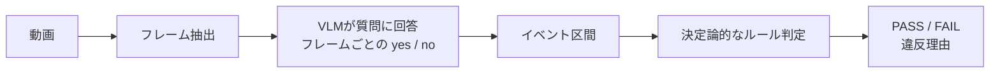

# small-vlm-sop-check

[English](README.en.md) | [ドキュメント](docs/README.md)

作業動画が手順書（SOP）に沿っているかを判定・評価する実験フレームワークです。**ローカルVLMは各フレームを見て質問に yes / no で答えるだけ**で、手順に沿っているかの判定は**決定論的なルール**が行います。

- 動画とSOPから、`PASS` / `FAIL` と違反理由を出力
- 人手アノテーションを正解として、VLMの回答の精度と判定の精度を別々に評価
- 注釈、推論、評価、結果の再生までをCLIで再現
- Apple Silicon上のローカルVLM 15モデルで同一条件を比較

<p align="center">
  <br>
  <sub>Replay viewer：フレームごとの回答、検出イベント、人手の正解区間、判定結果を1画面で確認できます。</sub>
</p>

## まず試す

Python 3.10以上が必要です。最初はVLMを使わず、同梱の回答ログ（VLMがフレームごとの質問に答えた記録、`answer_log.json`）をルールエンジンで判定します。

```bash
python3 -m pip install -e .

sop-check judge \
  --sop datasets/konro_inspection/sops/konro_inspection/correct.yaml \
  --answer-log datasets/konro_inspection/fixtures/reference_outputs/answer_log.json
```

成功すると、次の判定が表示されます。

```text
>>> 総合判定: PASS <<<
[正解照合] verdict ✓  =>  箇所特定 ✓
```

結果をブラウザで確認するには、replay viewerを生成します。

```bash
sop-replay
```

## なぜVLMに判定までさせないのか

VLMには、フレームごとの視覚的な質問だけを任せます。順序、同時性、禁止動作はルールエンジンが判定します。



この分離には、次の利点があります。

- モデルが何を見誤ったかと、ルールが何を違反としたかを切り分けられる
- 同じ回答ログに対してSOPだけを変え、判定をすぐに再実行できる
- 人手の事実、モデルの予測、評価結果を混ぜずに管理できる

設計の詳細は[事実・予測・評価を分離するADR](docs/decisions/0001-separate-facts-predictions-evaluations.md)を参照してください。

## 自分の動画で実行する

### 1. SOPを定義する

SOPには、VLMへの質問、回答から検出するイベント、イベント間の規則を記述します。

```yaml
sop:
  id: my_inspection
  name: 点検作業
  domain_hint: "作業台を上から撮影した点検動画"

questions:
  - id: knob
    ask: "手がつまみを操作しているか"
    values: ["yes", "no"]
  - id: pointing
    ask: "人が対象を指差しているか"
    values: ["yes", "no"]

events:
  ignite:
    evidence: "knob==yes"
    min_frames: 2
  check:
    evidence: "pointing==yes"

relations:
  - ignite before check

expect:
  verdict: PASS
```

本プロジェクトでは、境界ノイズに強い3種類のrelationを使います。

| relation | 意味 |
|---|---|
| `A before B` | Aの後にBを行う |
| `A overlaps B` | AとBが同時期に起きる |
| `not A` | Aを行わない |

全フィールドとFAIL理由の書き方は[SOPフォーマット](docs/reference/sop-format.md)にあります。

### 2. 人手で正解区間を付ける

注釈ツールで、動画中に各イベントが実際に起きた区間を記録します。ここで作る `ground_truth.json` は、人手で確認した事実だけを含みます。

```bash
sop-annotate --sop path/to/sop.yaml --frames-dir path/to/frames
```

同梱デモは引数なしでも起動できます。操作内容は自動保存されます。

### 3. VLMに回答させ、判定する

MLXバックエンドを使う場合は、macOS / Apple Silicon環境でVLM依存を追加します。

```bash
python3 -m pip install -e ".[vlm]"

sop-check run \
  --sop path/to/sop.yaml \
  --video path/to/video.mp4 \
  --model qwen3-4b \
  --out-dir out/my-run
```

初回実行時はモデルのダウンロードが発生します。回答の収集と判定は別々にも実行できます。

```bash
sop-check observe \
  --sop path/to/sop.yaml \
  --frames-dir path/to/frames \
  --model qwen3-4b \
  --out out/answer_log.json

sop-check judge \
  --sop path/to/sop.yaml \
  --answer-log out/answer_log.json
```

モデル一覧と生成設定は[モデルと生成オプション](docs/reference/models.md)を参照してください。

### 4. 二つの軸で評価する

判定が合っただけでは、モデルがフレームごとの質問に正しく答えられていたとは限りません。そのため評価を二つに分けます。

| 評価軸 | 確認すること | 正解データ |
|---|---|---|
| 回答 | フレームごとの回答やイベント区間が事実と合うか | 人手の `ground_truth.json` |
| 判定 | PASS / FAILと違反理由が期待どおりか | SOPの `expect` |

```bash
sop-check eval \
  --sop path/to/sop.yaml \
  --ground-truth path/to/ground_truth.json \
  --answer-log out/answer_log.json
```

回答の評価では、relation正答数、区間の重なり（mean tIoU）、質問ごとのフレーム一致率を出力します。指標の定義は[評価ポリシー](docs/benchmark/evaluation.md)にあります。

## ベンチマーク

### Konro Inspection

同一の16フレームに対し、3種類のSOP条件（正しい手順 / 順序違反 / ステップ欠落）と15モデルを比較した完結デモです。人手アノテーションを正解として評価しています。上位のみ抜粋:

| モデル | relations正答 | mean tIoU | 判定 |
|---|:---:|---:|:---:|
| Qwen3-VL-4B | 6/6 | 0.80 | 3/3 |
| Qwen2.5-VL-3B | 5/6 | 0.62 | 2/3 |
| SmolVLM2-2.2B† | 4/6 | 0.60 | 1/3 |
| Cosmos-Reason1-7B | 4/6 | 0.59 | 1/3 |
| Qwen3.5-4B | 4/6 | 0.53 | 2/3 |

3条件すべてで判定と違反理由を当てたのはQwen3-VL-4Bだけでした。ただし、これは単一の短い動画に対する結果であり、一般的な現場性能を示すものではありません。15モデルの全結果と再現コマンドは[Konroベンチマーク結果](docs/benchmark/konro-results.md)にあります（†はtransformersバックエンド計測）。

### Factory Ego

Egocentric-10Kから切り出した8 unit × 20 framesを使い、モデル間の精度比較を準備している開発用データセットです。

- 現在の8 unitは、すべて同じfactory / workerの `dev_seen`
- Fable 5、Opus 4.8とローカル小型VLM（Qwen3-VL-4B、Qwen3.5-4B、Qwen2.5-VL-3B）の出力は、すべて対等なprediction run
- 人手ground truthは未作成のため、正式なprecision、recall、F1、tIoUは未計測
- upstreamがgated datasetのため、抽出フレームは公開リポジトリに含めず、SHA manifestだけを追跡

人手GTができるまでの予備比較として、reference予測（Fable 5）とのイベント区間一致（mean tIoU）を測っています。精度ではありません:

| モデル | mean tIoU (vs Fable 5) |
|---|---:|
| Claude Opus 4.8 † | 0.89 |
| Qwen3-VL-4B | 0.67 |
| Qwen3.5-4B | 0.65 |
| Qwen2.5-VL-3B | 0.56 |

† Opusは共通1 unit・10フレームのみ。大型モデル同士のこの0.89が一致の上限アンカーで、ローカル勢ではKonro上位のQwen3-VL-4Bが最も近い区間を出します。詳細は[Factory Ego README](datasets/factory_ego/README.md)と[モデル比較レポート](reports/model_comparison.md)を参照してください。

## データセットと実験結果の置き場

| パス | 役割 | 公開上の扱い |
|---|---|---|
| `datasets/` | 入力媒体、SOP、人手アノテーション | 事実・仕様 |
| `runs/` | モデル、プロンプト、unitごとの予測 | 実験結果 |
| `evaluations/` | predictionと人手GTの評価 | 派生結果 |
| `reports/` | 複数runの比較と解釈 | レポート |

イベントは各動画unitの `sop_path` が指すSOPで定義します。詳しくは[動画ごとのイベント定義](docs/benchmark/events.md)を参照してください。

## CLI

| コマンド | 内容 |
|---|---|
| `sop-annotate` | 人手の正解区間をブラウザで注釈 |
| `sop-check run` | フレーム抽出、VLMの回答収集、判定を一括実行 |
| `sop-check observe` | VLMの回答収集だけを実行 |
| `sop-check judge` | 保存済み回答ログをルールで判定 |
| `sop-check eval` | 人手アノテーションに対して回答を評価 |
| `sop-check models` | 登録済みモデルを表示 |
| `sop-replay` | 自己完結型の結果再生HTMLを生成 |

## リポジトリ構成

```text
.
├── src/small_vlm_sop_check/  # CLI、判定、評価、VLM推論、Web UI
├── datasets/                 # 動画unit、SOP、人手アノテーション
├── runs/                     # モデル予測
├── evaluations/              # 評価結果
├── reports/                  # 比較レポート
├── schemas/benchmark/v1/     # JSON Schema
├── tools/                    # 移行、検証、公開品質チェック
├── tests/                    # unit / integration tests
└── docs/                     # 設計、運用、意思決定
```

各フォルダの責務は[リポジトリ構造](docs/development/repository-layout.md)、データ契約は[ベンチマーク全体像](docs/benchmark/README.md)にまとめています。

## 開発時の確認

```bash
python3 -m pip install -e ".[test]"
pytest
python3 tools/benchmark/validate.py
python3 tools/quality/check_docs.py
python3 tools/quality/check_public.py
```

Factory Egoのgated mediaをローカルに配置済みの場合は、`python3 tools/benchmark/validate.py --require-media` でハッシュまで検証できます。公開前の確認項目は[公開前チェックリスト](docs/development/public-release.md)を参照してください。

## 現在の制約

- 参照VLMバックエンドはApple Silicon向けのMLXです
- 既定の動画サンプリングは1 fpsです
- Factory Egoは人手GT作成前であり、正式な精度比較には使えません
- ベンチマーク結果は小規模なデモであり、導入判断には対象現場の動画で再評価が必要です

## ライセンス

コードはMIT Licenseです。詳細は[LICENSE](LICENSE)を参照してください。外部データセットとモデルには、それぞれの提供元のライセンスと利用条件が適用されます。
