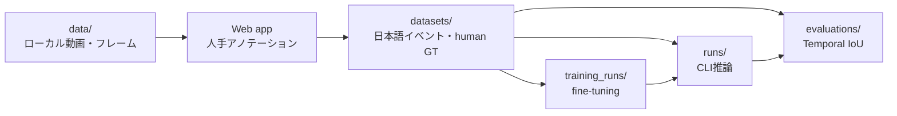

# Benchmark architecture

## データセット

- [Konro Inspection](../../datasets/konro_inspection/README.md): 人手GTと媒体を含む小さな完結デモ
- [Factory Ego](../../datasets/factory_ego/README.md): 20本の工場一人称動画を人手アノテーションするpilot

Factory Egoは全unitが `dev_seen` です。20本でアノテーション方法と推論条件を固めた後、未見worker・未見clipからvalidation/testを作ります。開発中の結果を正式test精度として報告しません。
