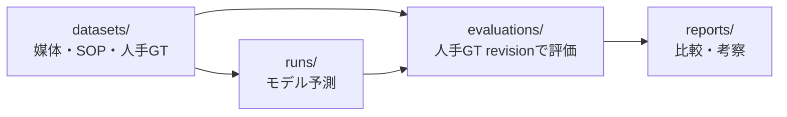

# Benchmark architecture

このリポジトリでは、デモと精度比較を同じデータ契約で扱います。`examples/` は設けず、すべての入力データを `datasets/` に統合します。

## 現在のデータセット

- [Konro Inspection](../../datasets/konro_inspection/README.md): 人手GTまで揃った完結デモ
- [Factory Ego](../../datasets/factory_ego/README.md): 8 unitの精度比較データ。人手GT作成前

モデル間一致は予備比較であり、人手GTに対する評価とは区別します。詳細は[評価ポリシー](evaluation.md)を参照してください。
